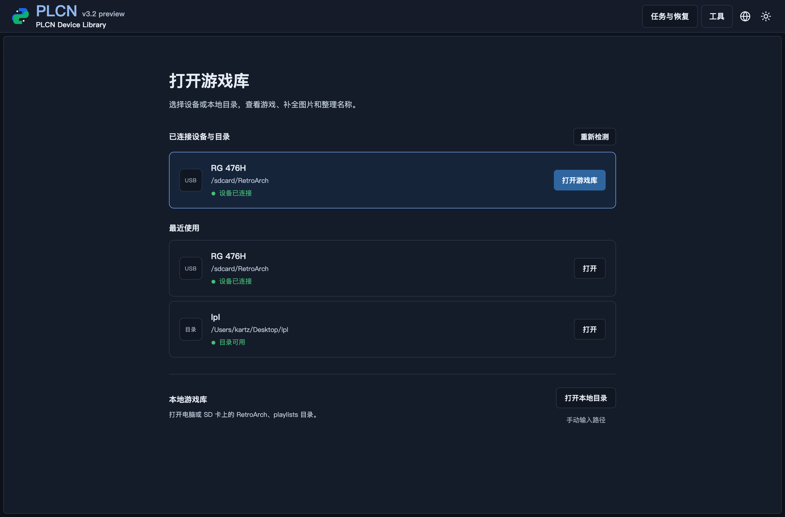
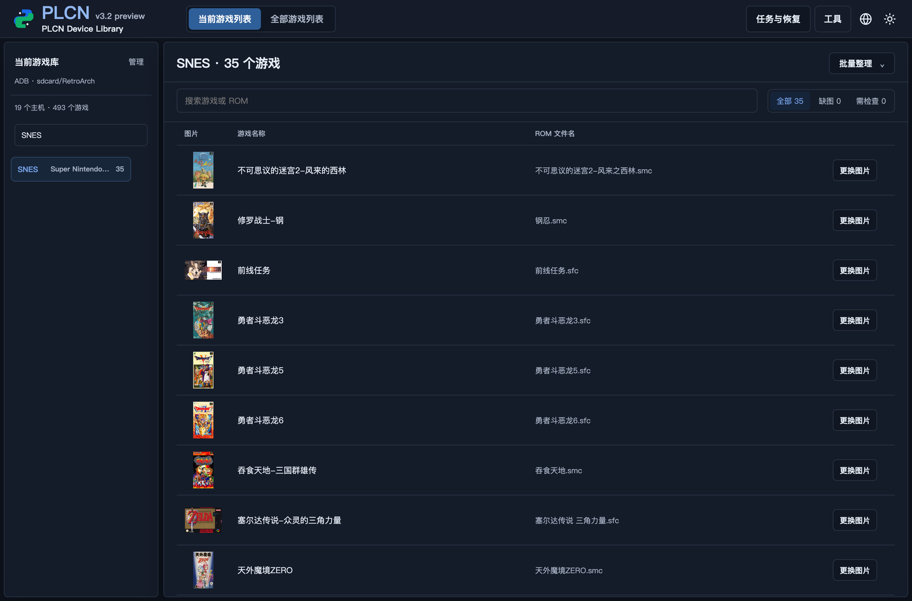
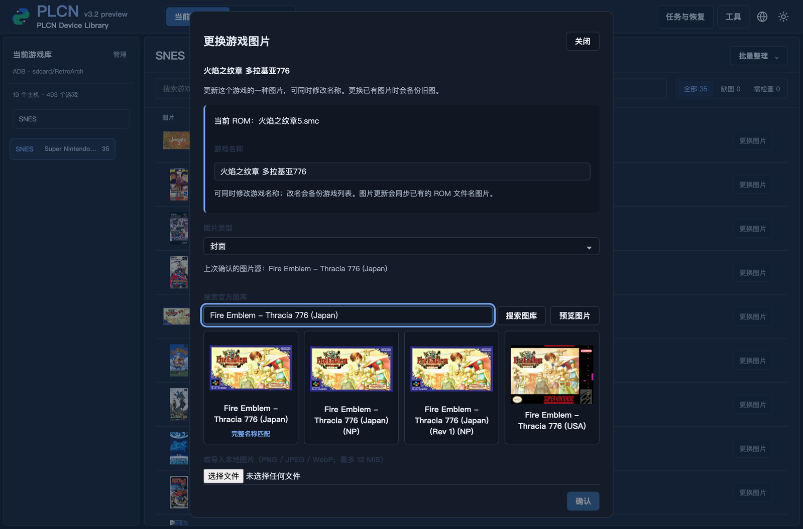

# PLCN

GitHub 默认显示中文版 README；英文版请点击：[English README](README_EN.md)。

PLCN 是 RetroArch 的本地游戏列表中文化与图片管理工具。它读取 `.lpl` 游戏列表，生成可校对的中文显示名和官方英文图片源，并在确认后写回游戏列表、下载封面、截图和标题图。

> PLCN 是 RetroArch 外部的本地辅助工具，不会修改 RetroArch 程序本体。

## 最新版本：v3.2.1

v3.2.0 集中提供设备连接、游戏浏览、批量整理和单游戏补图。启动后可选择已连接的 Android 设备、最近目录或本地目录；选择主机后直接查看当前游戏列表，并可从 Libretro 官方图库或本地图片修复封面、截图和标题图。







- 首页列出已连接设备、最近使用和本地目录。
- 游戏列表显示封面、游戏名称、ROM 文件名、缺图和需检查状态。
- 单游戏补图支持搜索官方图库、导入本地图片、修改名称；写入前预览，替换旧图时自动备份。
- 图片匹配遵循 RetroArch 的 ROM 文件名优先规则，避免 PLCN 与掌机内显示不一致。
- 名称和图片写入使用备份、快照检查、原子替换和读回验证；ADB 写入会先暂存并校验。
- 桌面安装包支持 Windows、macOS Intel/Apple Silicon 和 Linux；macOS/Windows 当前未签名，首次打开可能需要手动允许。

## 主要功能

- **游戏列表中文化**：读取 `.lpl` 文件，将游戏显示名匹配为中文名称。
- **设备与目录扫描**：扫描本地 RetroArch 根目录、`playlists` 目录、已挂载 SD 卡或已授权的 ADB Android 设备。
- **匹配与校对**：预览写入名称、封面源英文名、封面状态和修复状态；可逐行勾选或编辑。
- **智能缩略图下载**：从 Libretro 官方服务器下载封面、截图和标题图，支持常见命名差异与 FBNeo/Arcade 别名。
- **单游戏补图与改名**：从游戏行打开补图窗口，搜索官方图库或导入本地 PNG/JPEG/WebP。
- **批量处理**：一次处理目录中的多个 `.lpl` 文件。
- **本地缓存与人工覆盖**：手动校正保存在本机 `manual_overrides.json`，下次预览优先应用。
- **跨平台分发**：提供 Windows、macOS 和 Linux 构建。

## 安装

从 [Releases](https://github.com/MightyKartz/PLCN/releases) 下载对应平台的最新版本：

- **Windows**：`PLCN-Windows-x64.exe`
- **macOS**：`PLCN-macOS-x64.tar.gz`
- **Linux**：`PLCN-Linux-x64.tar.gz`

普通用户无需安装 Xcode、Node.js 或执行许可命令。Windows 运行安装包；macOS 解压后双击；Linux 解压后运行。当前 macOS/Windows 构建未签名，首次打开可能需要在系统安全设置中允许。

发布版本由 GitHub Actions 自动打包；本机源码运行不需要打包环境。

## 使用方法

1. 启动程序后，在首页选择已连接设备、最近目录或本地目录。
2. 选择主机查看当前游戏列表，使用搜索和缺图筛选定位游戏。
3. 使用右上角“批量整理”预览名称与图片修复建议；也可以打开单个游戏的补图窗口。
4. 核对写入名称和图片源后确认应用；PLCN 会写回列表并下载图片。

## 从源码运行

适合开发或本机验证，无需 Xcode：

```bash
pip install -r requirements.txt
python3 src/plcn.py
```

正式安装包由 GitHub Actions 在发布时生成。只有维护者在本机手动打包 macOS DMG 时才需要本机 Xcode 许可。

命令行单个列表：

```bash
python3 src/plcn.py   --playlist "/path/to/playlist.lpl"   --system "Sony - PlayStation"   --thumbnails-dir "/path/to/RetroArch/thumbnails"
```

批量处理：

```bash
python3 src/plcn.py   --batch-dir "/path/to/playlists"   --thumbnails-dir "/path/to/RetroArch/thumbnails"
```

## 本地数据

- `manual_overrides.json` 只保存在本机，用于保留人工校正结果。
- 不启用云同步、在线匹配或外部刮削；本地数据优先。
- 详细操作见 [桌面使用指南](DOC/DESKTOP_GUIDE.md)。

## 开发

```bash
python3 -m pytest -q
python3 -m compileall -q src
python3 scripts/check_ui_js.py
git diff --check
```

## 致谢

感谢 [rom-name-cn](https://github.com/yingw/rom-name-cn) 提供的 ROM 中文名称数据。
